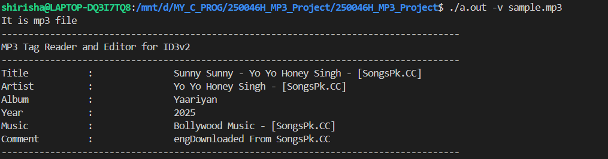
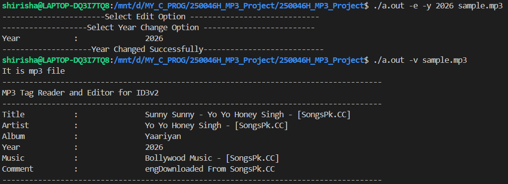

# MP3 Tag Reader & Editor in C

A **command-line based MP3 Tag Reader and Editor** implemented in **C**, which allows users to **view and modify ID3 metadata** of MP3 files such as title, artist, album, year, genre, and comments.

This project demonstrates **low-level file handling**, **binary file processing**, and **system-level programming concepts** in C.

---

## Project Overview

MP3 files contain metadata (ID3 tags) that store song information.  
This project reads and edits those tags directly from the MP3 file without using any external libraries.

The application supports:
- Viewing MP3 metadata
- Editing specific tag fields
- Strong input validation
- Safe file update operations

---

## Features

- View MP3 ID3 tag details  
- Edit MP3 metadata fields  
- Binary file parsing  
- Command-line based interface  
- Input validation and error handling  
- Modular and structured C design  

---

## Concepts Used    
- File Handling (Binary Files)  
- Pointers & Dynamic Memory Allocation  
- Structures  
- Command Line Arguments  
- Modular Programming  

---

## Images
### View MP3 Tags

### Edit MP3 Tags

## 📂 Project Structure

